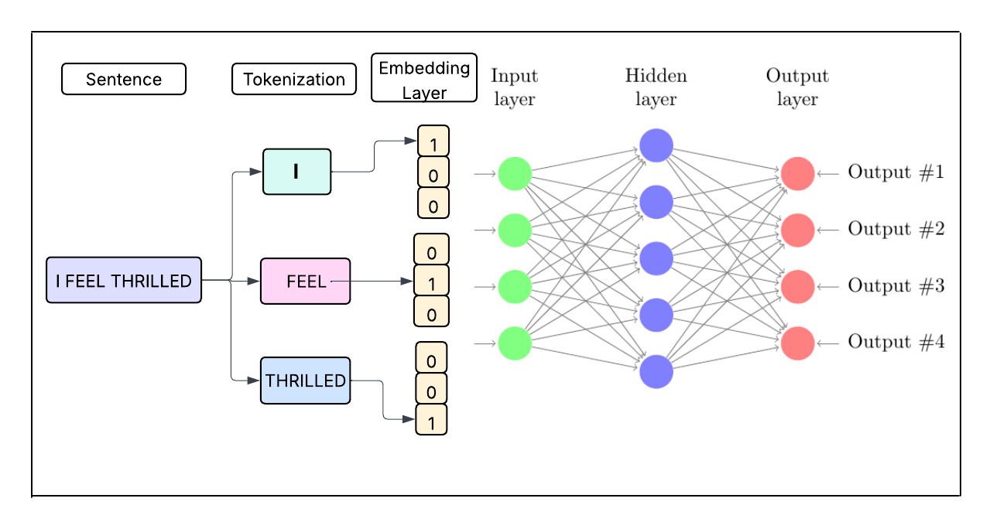
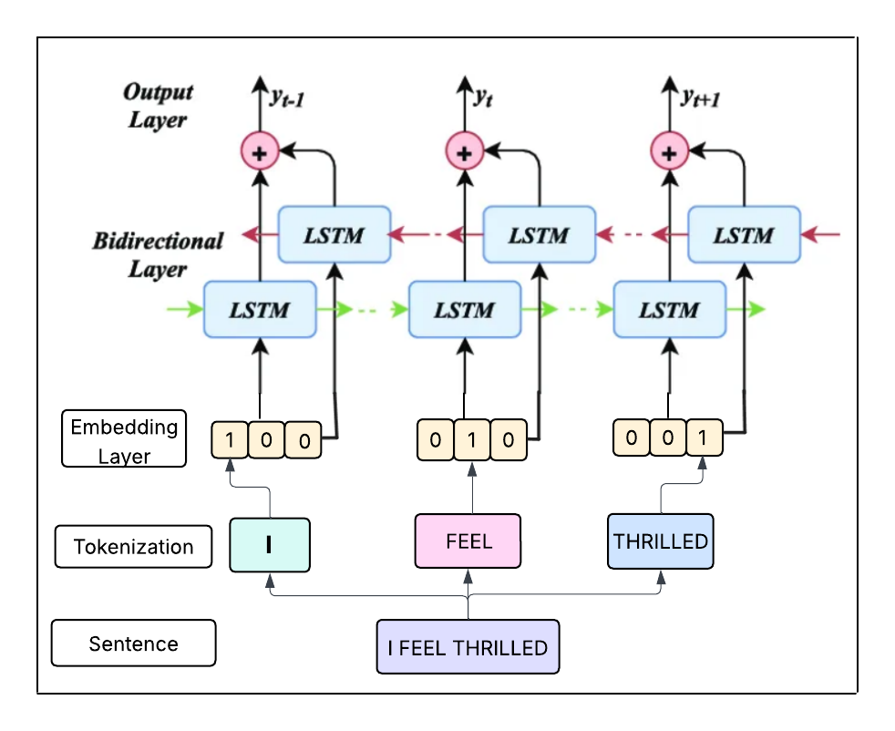

# Emotion-Aware-Recommendation-System

A sophisticated movie recommendation system that analyzes user sentiment/emotion using LSTM neural networks and recommends movies based on content similarity using cosine similarity algorithms. This project combines natural language processing and machine learning to create a personalized movie recommendation experience. The system analyzes user input to detect their emotional state and suggests movies that align with their current mood.

## Project Overview
This project presents a detailed comparative study between traditional Artificial Neural Networks and Long Short-Term Memory networks for sentiment analysis in movie recommendation systems. The study analyzes architectural differences, performance metrics, and practical implications of each approach.

The project consists of two main components:

**Sentiment Analysis Module**: Uses LSTM (Long Short-Term Memory) neural networks to analyze user text input and classify emotional states

**Movie Recommendation Module**: Employs cosine similarity algorithms to recommend movies based on the detected mood and content features

## Demo


## Datasets Used

[Emotion Dataset](https://huggingface.co/datasets/dair-ai/emotion)

- Emotion is a dataset of English Twitter messages with six basic emotions: sadness (0), joy (1), love (2), anger (3), fear (4) & surprise (5).
- Used for training the LSTM sentiment analysis model.
- Preprocessed and cleaned for optimal model performance

[Movies Dataset](https://www.kaggle.com/datasets/satpreetmakhija/netflix-movies-and-tv-shows-2021)

- Comprehensive movie information including genres, descriptions & IMDB Scores
- Used for content-based recommendation system
- Features engineered for similarity calculations

## System Architecture
### ANN Architecture


### LSTM Architecture


## Features

- **Mood Detection:** Advanced LSTM-based sentiment analysis for accurate emotion classification
  
- **Content-Based Filtering:** Cosine similarity algorithm for movie recommendations
  
- **Mood-Genre Mapping:** Intelligent mapping between detected emotions and movie genres
  
- **Scalable Architecture:** Modular design for easy extension and maintenance
  
- **Pre-trained Models:** Ready-to-use trained models for quick deployment
  
- **Comparative Study:** Built with both ANN and LSTM for comparative performance study
  
- **Random Sampling:** "Get New Recommendations" using random sampling

## Technologies Used

- **Python Version:** 3.8+
- **TensorFlow:** Deep learning framework for LSTM implementation
- **NLTK / Scikit-Learn:** Text preprocessing & similarity calculation
- **Pandas/NumPy:** Data manipulation and analysis
- **Matplotlib/Seaborn:** Data visualization
- **Jupyter Notebook** - Integrated Development Environment

## Project Structure
```
Netflix-Movie-Recommender
├── datasets/                 
│   ├── emotion-detection.csv    
│   ├── movies-dataset.csv       
│   └── README.md               
├── code/                     
│   ├── sentiment_analysis.ipynb   
│   ├── recommendation_system.ipynb
│   └── README.md               
├── models/                   
│   ├── lstm_model.h5           
│   ├── tokenizer.pkl           
│   ├── label_encoder.pkl       
│   ├── config.json           
│   └── README.md             
└── README.md                 
```
## Folder Details

`Datasets` : CSV files for emotion detection and movie metadata

`Code` : Jupyter Notebooks for model training, testing and recommendation

`Models` : Saved .h5 model, tokenizer, label encoder and config

`Assets` : Visuals, GIFs, charts for presentation or UI demos

`App` : Streamlit Code

## Installation & Setup

### Clone the repository

```
git clone https://github.com/Ashmita120/Emotion-Aware-Recommendation-System.git
```
### Enter the current directory
```
cd Emotion-Aware-Recommendation-System
```

### Install dependencies
```
pip install -r requirements.txt
```

## Usage

**1. Sentiment Analysis**

- Open `Code/sentiment_analysis.ipynb`
- Train the LSTM model or load pre-trained model
- Test emotion detection with sample text

**2. Movie Recommendation**

- Open `Code/recommendation_system.ipynb`
- Load the movie dataset
- Generate recommendations based on detected mood

**3. End-to-End Pipeline**

- Combine both modules for complete functionality
- Input user text → Detect mood → Recommend movies
